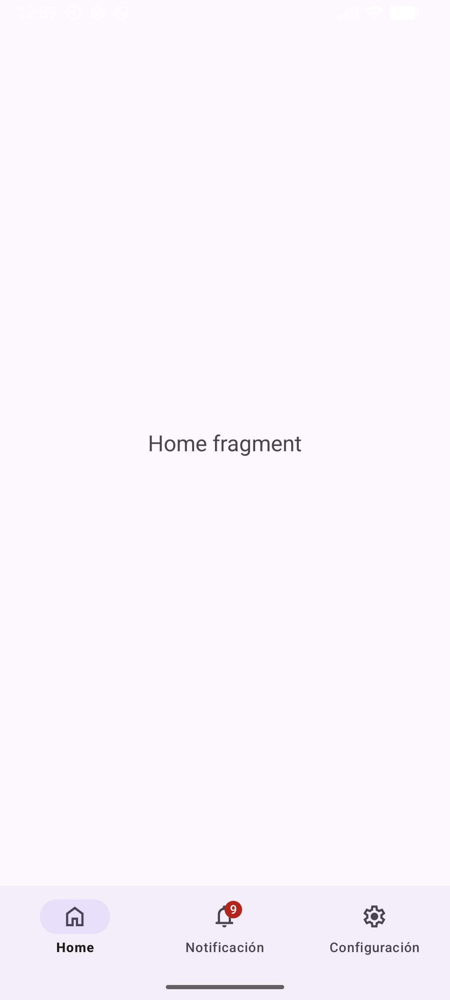
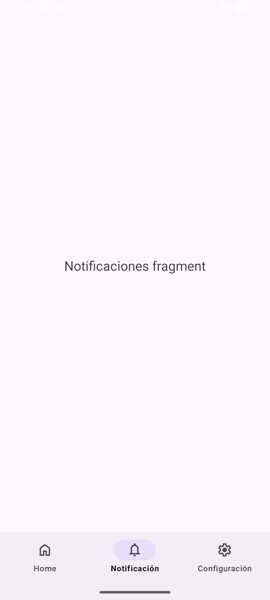
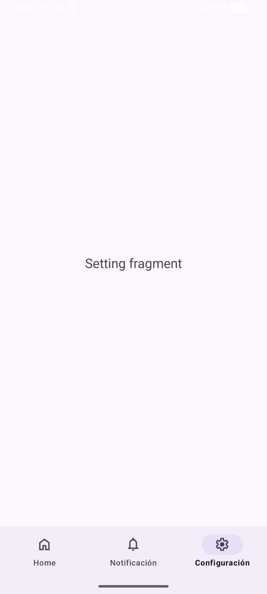

# Ejercicio.  Uso de BottomNavigation 

En el ejericio se creó una barra de navegación inferior ([BottomNavigationView]()) en donde se 
agregaron tres menú: home, notificaciones y Configuración. Cuando el usuario selecciona una de esas
opciones, en la Activity principal se muestra un Fragmento correspondiente a la opción seleccionada.

El ejercicio emplea el control BottomNavigationView vinculado un archivo de recurso menú. En el menú
(bottom_nav_menu.xml) se especifican los items con su correspondiente ícono y la leyenda mostrada.
En la Activity principal se encuentra la lógica que maneja los eventos de la barra de navegación, además 
se incluye el manejo de agregar y quitar Badges en la opción de menú notificaciones.

La aplicación utiliza los controles: **BottomNavigationView**, **BadgeDrawable**, **menu**, **Fragments**.
Se utilizaron los objetos **supportFragmentManager**, **Badges**

    

<b>Figura 1.</b> Captura de pantalla de la Activity principal con la opción Home

    

<b>Figura 2.</b> Captura de pantalla con la opción Notificaciones (se quita el badge)

<!--

-->

    

<b>Figura 3.</b> Captura de pantalla con la opción Configuración

# Enlaces de referencias

1. [Navigation bar] (https://m3.material.io/components/navigation-bar/guidelines) Material Design - Guía de uso
2. [Bottom navigation] (https://github.com/material-components/material-components-android/blob/master/docs/components/BottomNavigation.md) Android Views (MDC-Android)
3. [Fragment Manager] (https://developer.android.com/guide/fragments/fragmentmanager?hl=es-419) Como usar el administrador de fragmenttos
4. [Badge] (https://m3.material.io/components/badges/guidelines) Material Design - Guía de uso

